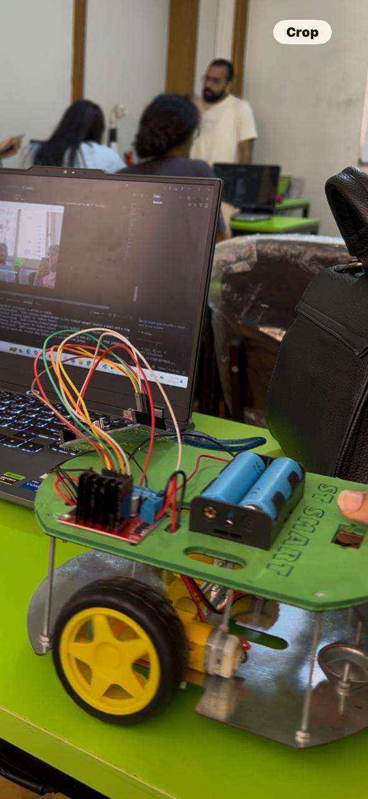

# 🚗 HandDrive — Computer Vision Based Gesture-Controlled Robotic Car

**HandDrive** is a real-time robotic car controlled using **hand gestures** detected through a webcam.

The project combines **Computer Vision, Hand Gesture Recognition, Python, MediaPipe, OpenCV, Arduino, and an L298N Motor Driver** to create a hands-free human-machine interface for controlling a robotic car.

---

## 📌 About the Project

HandDrive allows users to control a robotic car by moving their hands in front of a camera.

The system uses **MediaPipe Hand Landmarker** to detect hands and analyze their positions. Python processes the detected hand movement and converts it into movement commands, which are sent to an Arduino through **Serial Communication**.

The Arduino receives these commands and controls the motors through an **L298N Motor Driver**.

### 🔄 System Flow

```text
Webcam
   ↓
OpenCV
   ↓
MediaPipe Hand Landmarker
   ↓
Hand Landmarks
   ↓
Hand Position & Angle Analysis
   ↓
Gesture Classification
   ↓
Serial Communication
   ↓
Arduino
   ↓
L298N Motor Driver
   ↓
DC Motors
   ↓
🚗 Robotic Car
```

---

## ✋ Gesture Controls

The current implementation uses two detected hands to determine the movement direction.

| Gesture                          | Command | Car Action |
| -------------------------------- | ------- | ---------- |
| ↔️ Hands approximately aligned   | `F`     | Forward    |
| ↗️ Hands angled                  | `R`     | Right      |
| ↖️ Hands angled                  | `L`     | Left       |
| ❌ No/insufficient hands detected | `S`     | Stop       |

### Serial Commands

```text
F → Forward
B → Backward
L → Left
R → Right
S → Stop
```

The Arduino also supports the `B` command for backward movement, which can be connected to a dedicated backward gesture in future versions.

---

## 🧠 Computer Vision

The project uses **MediaPipe Hand Landmarker** for real-time hand tracking.

Each detected hand contains **21 landmarks**, including the wrist and finger landmarks.

The current implementation analyzes the wrist positions of two detected hands and calculates the angle between them:

```python
dx = x2 - x1
dy = y2 - y1

angle = math.degrees(math.atan2(dy, dx))
```

The calculated angle is then used to classify the car's movement direction.

---

## 🛑 Safety Feature

Safety is an important part of HandDrive.

The system automatically sends:

```text
S
```

when:

* No hands are detected.
* Only one hand is detected.
* Control is lost.

Before exiting, Python also sends a final stop command:

```python
arduino.write(b"S")
```

This helps prevent the car from continuing to move when control is lost.

---

## 🛠️ Technologies Used

### Software

* Python
* OpenCV
* MediaPipe
* PySerial
* Math

### Hardware

* Arduino
* L298N Motor Driver
* DC Motors
* Robotic Car Chassis
* Webcam
* USB Serial Communication
* HC Bluetooth Module

---

## 🔌 Arduino Pin Configuration

The Arduino uses the following L298N connections:

| Component | Arduino Pin |
| --------- | ----------: |
| ENA       |           6 |
| IN1       |           4 |
| IN2       |           5 |
| ENB       |           9 |
| IN3       |           7 |
| IN4       |           8 |

### Bluetooth

The Arduino uses `SoftwareSerial`:

| Bluetooth | Arduino |
| --------- | ------: |
| RX        |      10 |
| TX        |      11 |

Motor speed is currently controlled using PWM:

```cpp
analogWrite(ENA, 180);
analogWrite(ENB, 180);
```

---

## 📂 Project Structure

```text
HandDrive/
│
├── car.py
├── car code arduino2.ino
├── hand_landmarker.task
├── handdrive-demo.mp4
└── README.md
```

### `car.py`

The Python program is responsible for:

* Opening the webcam
* Detecting hands
* Processing MediaPipe landmarks
* Calculating hand angles
* Classifying movement
* Sending commands to Arduino

### `car code arduino2.ino`

The Arduino program is responsible for:

* Receiving commands
* Controlling the L298N motor driver
* Controlling the DC motors
* Supporting Bluetooth commands

### `hand_landmarker.task`

MediaPipe hand landmark model used for hand detection.

---

## 📦 Installation

### 1. Clone the Repository

```bash
git clone https://github.com/aytenakl/HandDrive.git
cd HandDrive
```

### 2. Install Dependencies

```bash
pip install opencv-python mediapipe pyserial
```

---

## ▶️ Running the Project

### Step 1 — Connect the Arduino

Connect the Arduino to your computer using USB.

### Step 2 — Check the COM Port

Find the COM port assigned to your Arduino.

For example:

```python
arduino = serial.Serial("COM16", 9600)
```

If your Arduino uses another port, change it accordingly:

```python
arduino = serial.Serial("COM5", 9600)
```

### Step 3 — Upload the Arduino Code

Open the `.ino` file in Arduino IDE and upload it to the Arduino.

Make sure the baud rate is:

```cpp
Serial.begin(9600);
```

### Step 4 — Run Python

```bash
python car.py
```

The webcam will open and begin detecting hand movements.

### Step 5 — Control the Car

Move both hands in front of the webcam to control the robotic car.

Press:

```text
Q
```

to exit the program.

---

## 📡 Serial Communication

Python communicates with Arduino using **PySerial**.

### Communication Settings

```text
Baud Rate: 9600
```

### Commands

```text
F → Forward
B → Backward
L → Left
R → Right
S → Stop
```

The Arduino can receive commands through:

```text
Python / USB Serial
        ↓
     Arduino
        ↑
    Bluetooth
```

---

## 🚗 Motor Control

The L298N motor driver controls the two DC motors.

### Forward

```text
Left Motor  → Forward
Right Motor → Forward
```

### Backward

```text
Left Motor  → Backward
Right Motor → Backward
```

### Left

```text
Left Motor  → Backward
Right Motor → Forward
```

### Right

```text
Left Motor  → Forward
Right Motor → Backward
```

### Stop

```text
Left Motor  → Stop
Right Motor → Stop
```

---

## ✨ Key Features

* ✋ Real-time hand tracking
* 👁️ Computer vision-based control
* 🤖 Robotic car control
* 📐 Hand-angle-based steering
* 🔌 Arduino serial communication
* 📡 Bluetooth support
* 🛑 Automatic stop when hands are lost
* ⚡ Real-time processing
* 🧩 Python + Arduino architecture

---

## 🔮 Future Improvements

* ↩️ Add a dedicated backward gesture
* ✋ Add more gesture commands
* ⚡ Implement dynamic speed control
* 📏 Use hand distance to control speed
* 🚧 Add ultrasonic obstacle detection
* 🤖 Add autonomous driving mode
* 🧠 Add custom machine-learning gestures
* 🎯 Improve gesture stability
* 🔄 Add gesture calibration

---

## 📸 Demo

The following image shows the HandDrive robotic car prototype.



---

## 🎥 Project Demo

### HandDrive in Action

The following video demonstrates the robotic car being controlled in real time using hand gestures.

[▶️ Watch the HandDrive Demo](handdrive-demo.mp4)

